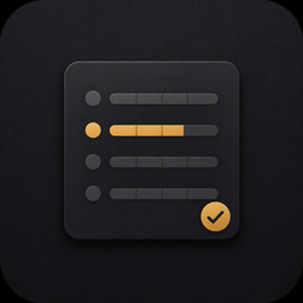
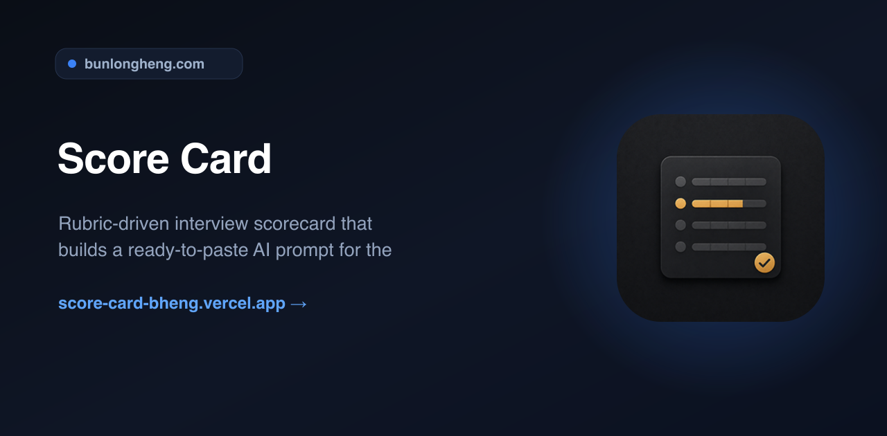
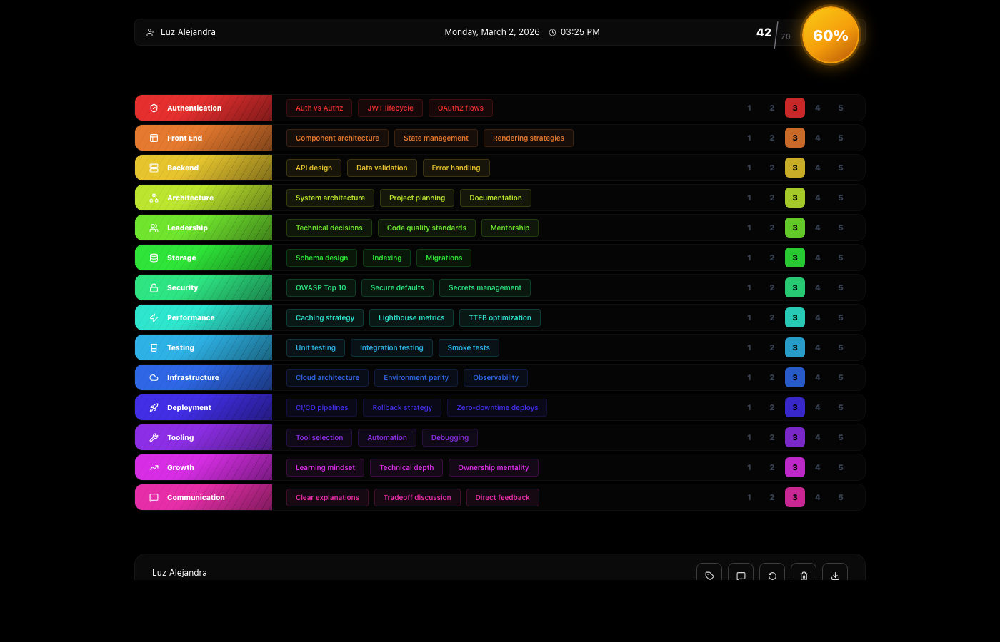
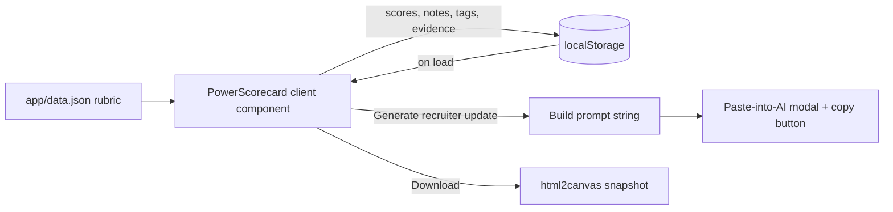

<div align="center">
  
  <h1>Score Card</h1>
  <p><em>Rubric-driven interview scorecard that builds a ready-to-paste AI prompt for the recruiter update</em></p>
  <p><a href="https://score-card-bheng.vercel.app">Live</a> &middot; <a href="https://github.com/bunlongheng/score-card">Repo</a> &middot; <a href="https://bunlongheng.com/projects?name=score-card">Portfolio</a></p>
  
</div>

---

<div align="center">

# Score Card

Technical-interview scorecard - a built-in rubric of 14 categories and 56 topics, 1-5 sliders per category, a quiz-style drill-down per topic with strong-signal/red-flag cues, and a one-click prompt generator for an AI-written recruiter summary.



**[Try it live](https://score-card-bheng.vercel.app)**

[](LICENSE)


</div>

## Features

- **Built-in rubric** - `data.json` ships 14 categories (Authentication, Front End, Backend, Architecture, Leadership, Storage, Security, Performance, Testing, Infrastructure, Deployment, Tooling, Growth, Communication) x 4 topics each, every topic pre-written with a follow-up question, an expected answer, and 3-4 strong signals / red flags.
- **1-5 scoring per category** - click a number to score; a live circular badge shows earned/total and a color tier (red / amber / green) that pops confetti on a tier change.
- **Topic drill-down** - click any topic pill to open its question, expected answer, and strong-signal/red-flag panels side by side, with a 60-second built-in timer that resets per topic and flashes when it expires.
- **Know it / don't know it** - mark each topic during the drill-down; marking "knows it" fires a heart-shaped confetti burst and feeds the recruiter-summary prompt.
- **Rubric Q&A browser** - a separate modal lists every question, answer, and strong signal from `data.json` in one scroll, for prep before the interview starts.
- **Recruiter-summary prompt generator** - builds a structured prompt from the candidate's scores, notes, and per-topic know/don't-know evidence, then opens it in a "paste into AI" modal with a word/token estimate and a copy button. It does not call an AI API itself - you paste the prompt into Claude, ChatGPT, or any LLM you already use.
- **Candidate tag badges** - optional recruiter / type / location / country / project / team / manager tags, picked from a config panel and rendered under the notes field.
- **Notes editor** - line-numbered textarea that tracks the active line and syncs scroll position.
- **Row textures** - double-click a category row to cycle its background texture (stripes, crosshatch, carbon, veil).
- **Export as PNG** - `html2canvas` rasterizes the full page (dark background) into a downloadable, timestamped PNG.
- **Local persistence** - candidate, scores, notes, topic evidence, and tag selections are saved to `localStorage` and restored on reload; a "reset" wipes everything for the next interview.

## How it works

Score Card is a single client component (`app/page.tsx`) rendered from a static rubric (`app/data.json`) - there is no backend, no database, and no auth. `next.config.ts` sets `output: "export"`, so the whole app builds to static HTML/JS and deploys as a static site.



The `@anthropic-ai/sdk` dependency exists for building an AI-agnostic prompt (word/token estimate only) - the app never holds an API key or calls a model directly, which is also why it can ship as a fully static export.

## Tech stack

| Layer | Choice |
|-------|--------|
| Framework | Next.js 15 (App Router), static export |
| UI | React 19, TypeScript (strict) |
| Styling | Tailwind CSS 3 |
| Icons | lucide-react |
| PNG export | html2canvas |
| Persistence | Browser `localStorage` (no database) |
| Hosting | Vercel |

## Getting started

```bash
git clone https://github.com/bunlongheng/score-card.git
cd score-card
npm install
npm run dev
```

Open http://localhost:4000.

| Script | Description |
|--------|-------------|
| `npm run dev` | Dev server on port 4000 |
| `npm run build` | Static export build (`output: "export"`) |
| `npm run start` | Serve the production build |

## Design decisions

| Decision | Why |
|----------|-----|
| No AI API call, prompt-only | Keeps the app a static export with zero secrets and zero server - the prompt is built client-side and pasted into whichever AI tool you already have open. |
| `localStorage` instead of a database | Single-interviewer, single-session tool - no accounts, no sync needed, nothing to host. |
| Static export (`output: "export"`) | The whole app is one client page; no server-rendered routes means it can be hosted anywhere as plain static files. |
| Practical max is 4/5 per category, not 5/5 | A perfect 5 is rare in real interviews, so the color tiers (red/amber/green) and recruiter-summary tier are computed against a 4-point ceiling to stay realistic. |

## License

[MIT](LICENSE) (c) Bunlong Heng

---

<p align="center">
  <sub>Built by <a href="https://bunlongheng.com">Bunlong Heng</a> &middot; <a href="https://bunlongheng.com/projects/score-card">See it in my portfolio &rarr;</a></sub>
</p>
